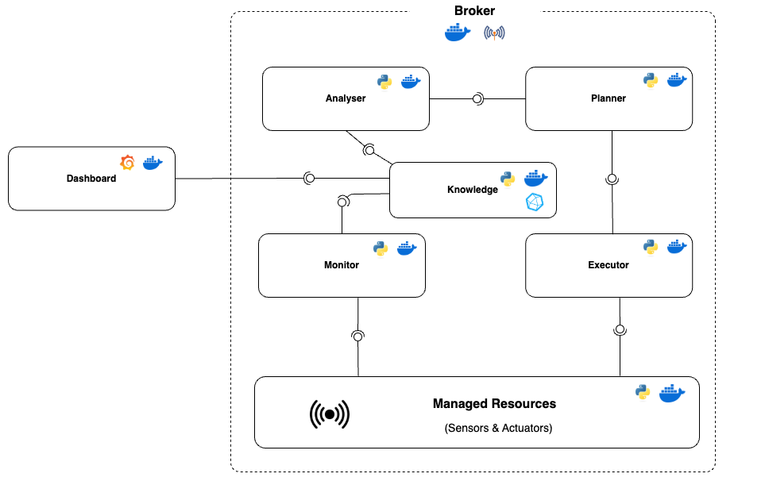

# SE4AS_Autonomous_Greenhouse


## Project Overview
The Greenhouse Autonomous System optimizes crop growth using the MAPE-K framework (Monitor, Analyze, Plan, Execute, Knowledge). It autonomously manages temperature, humidity, light, and CO₂ levels to maintain optimal plant growth conditions. A microservice architecture with Docker containers is employed, and components communicate via an MQTT broker for real-time data exchange.

<p align="center">
  
</p>

## Getting Started
### Prerequisites
- Docker and Docker Compose installed.

### Installation Steps
1. Clone the project repository:
   ```bash
   git clone https://github.com/yourusername/greenhouse-autonomous-system.git
   cd greenhouse-autonomous-system
   ```
2. Start the Docker containers:
   ```bash
   docker-compose up --build
   ```
3. Access the Grafana Dashboard:
   - URL: `http://localhost:3000`
   - Default credentials: `admin` / `admin`


## Project Structure
The project is organized into several directories, each serving a specific purpose:

- **analyzer/**: Contains the analysis scripts and configurations.
  - `analyzer.py`: Main analysis script.
  - `Dockerfile`: Docker configuration for the analyzer.
  - `greenhouse_threshold.json`: Configuration file for greenhouse thresholds.
  - `requirements.txt`: Python dependencies for the analyzer.

- **executor/**: Contains the execution scripts and configurations.
  - `executor.py`: Main execution script.
  - `Dockerfile`: Docker configuration for the executor.
  - `sector_config.json`: Configuration file for sector-specific settings.
  - `requirements.txt`: Python dependencies for the executor.

- **grafana/**: Contains Grafana dashboards and provisioning configurations.

- **influxdb/**: Contains InfluxDB engine and database files.

- **Knowledge/**: Contains knowledge management scripts and configurations.
  - `manage_knowledge.py`: Script for managing knowledge base.
  - `Dockerfile`: Docker configuration for knowledge management.
  - `requirements.txt`: Python dependencies for knowledge management.

- **managed_resources/**: Contains managed resources and related configurations.

- **monitor/**: Contains monitoring scripts and configurations.

- **mosquitto/**: Contains Mosquitto MQTT broker configurations.

- **planner/**: Contains planning scripts and configurations.

- **shared_config/**: Contains shared configuration files.

- **shared_files/**: Contains shared files used across the project.


## Technologies Used
- **Docker:** Manages microservice containerization.
- **Eclipse Mosquitto:** Handles real-time MQTT messaging.
- **InfluxDB:** Stores time-series environmental data.
- **Grafana:** Displays real-time and historical data on dashboards.
- **Python:** Implements monitoring, analysis, and execution services.

## Usage
- **View Real-Time Data:** Use the Grafana dashboard.
- **Modify Thresholds:** Edit configuration files.
- **Check Logs:** View Docker container logs.

---

## Authors
- Mariama Celi S. de Oliveira
- Motunrayo Osatohanmen Ibiyo

## Professor
- Davide Di Ruscio (Software Engineering for Autonomous Systems)
